# AEGIS — System Understanding Diagrams

**Based on:** `09-FINAL-LOCKED-DECISIONS.md` (batches **1–5**)  
**Purpose:** Visual check of locked understanding — architecture, data, inference, UX, governance, hazards.

---

## 1. Product strategy — Shield & Sword

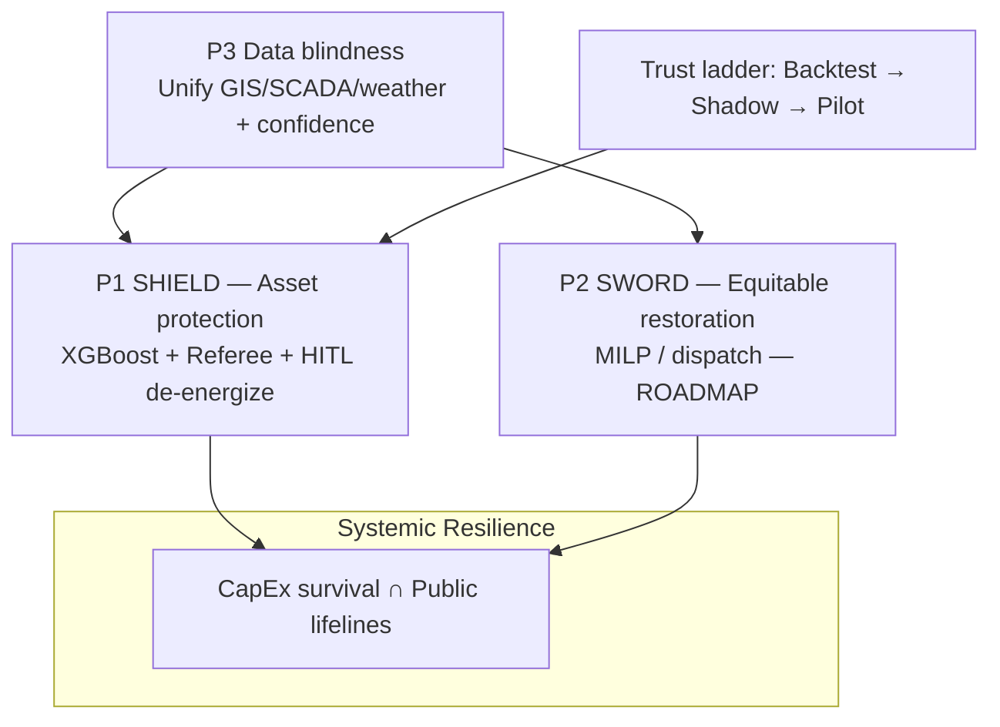

---

## 2. Cascading failure (why dependencies matter)

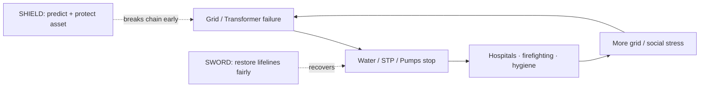

---

## 3. System context (who talks to what)

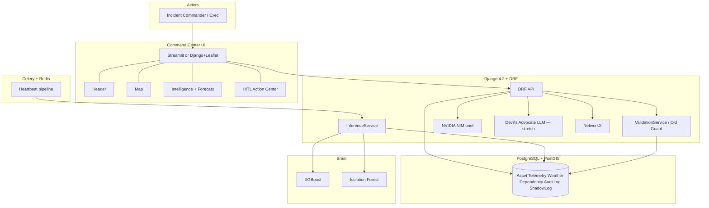

---

## 4. Data model (extended ORM)

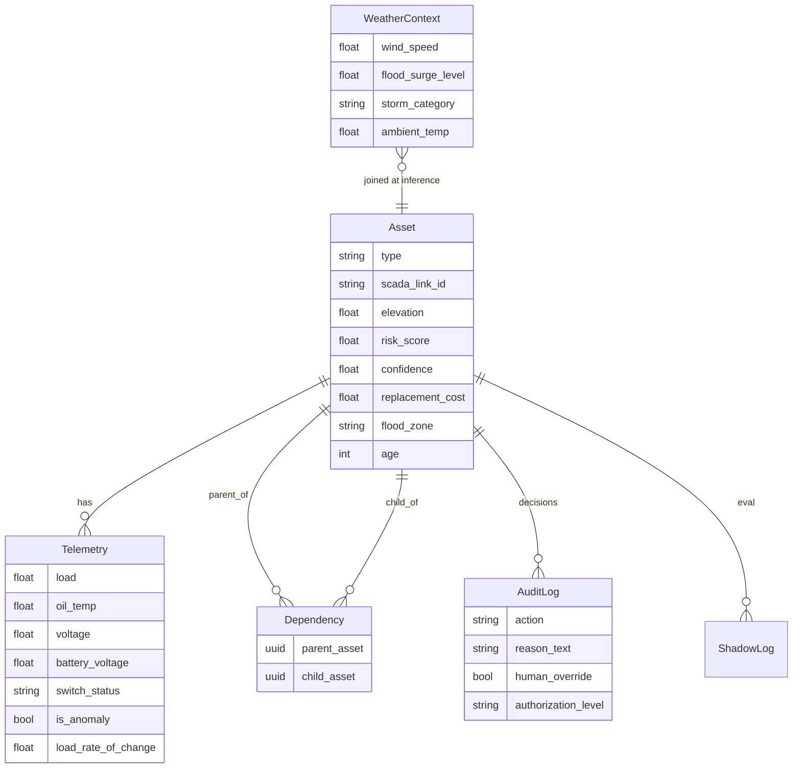

**Big Three + lifelines:** `Transformer`, `Battery`, `Switchgear`, `Pump`, `Hospital`, `WaterPlant`

---

## 5. AEGIS Heartbeat (continuous pipeline)

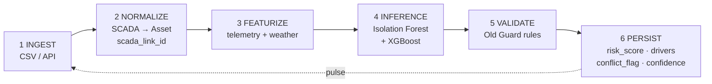

**Core XGB vector:** `[load, oil_temp, wind_speed, surge_level]`

---

## 6. Inference + Old Guard + optional Devil’s Advocate

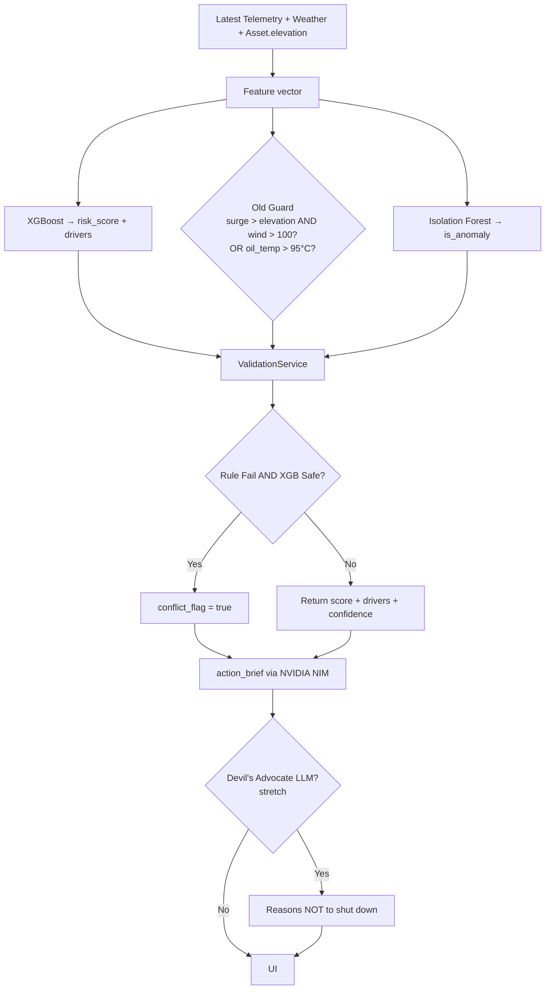

---

## 7. Graduated response L1–L4

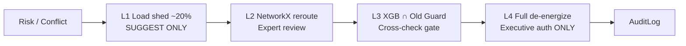

---

## 8. Multi-hazard modes

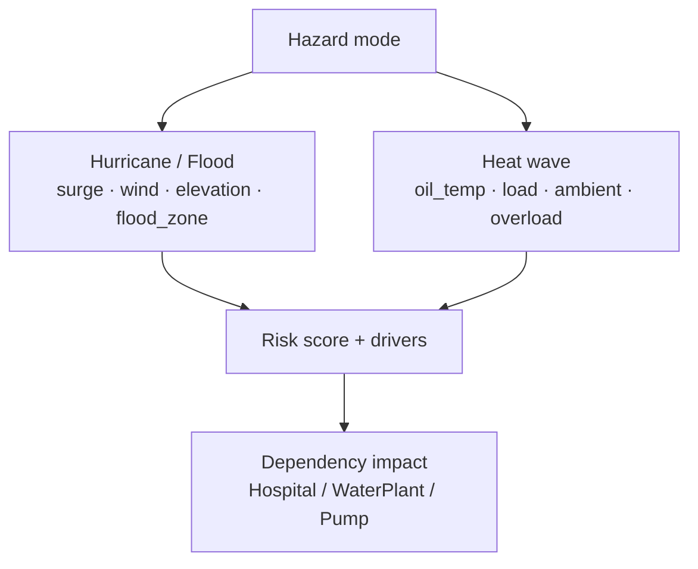

---

## 9. Shield user flow (full Command Center)

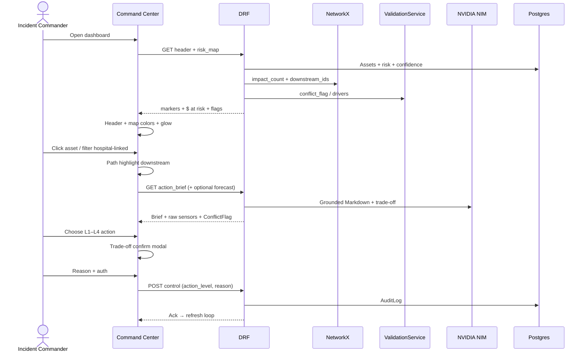

---

## 10. UI layout — four components

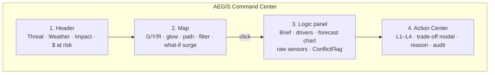

---

## 11. Data quality / degraded storm ops

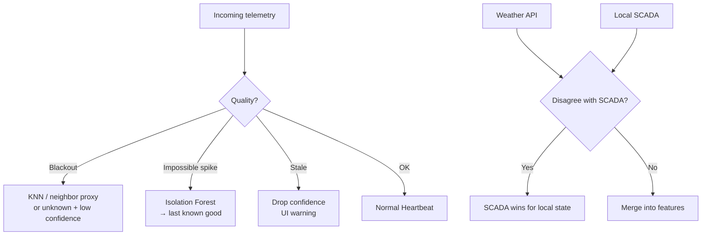

---

## 12. Eval & trust ladder

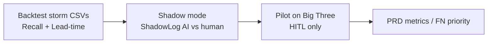

---

## 13. MVP vs roadmap algorithms

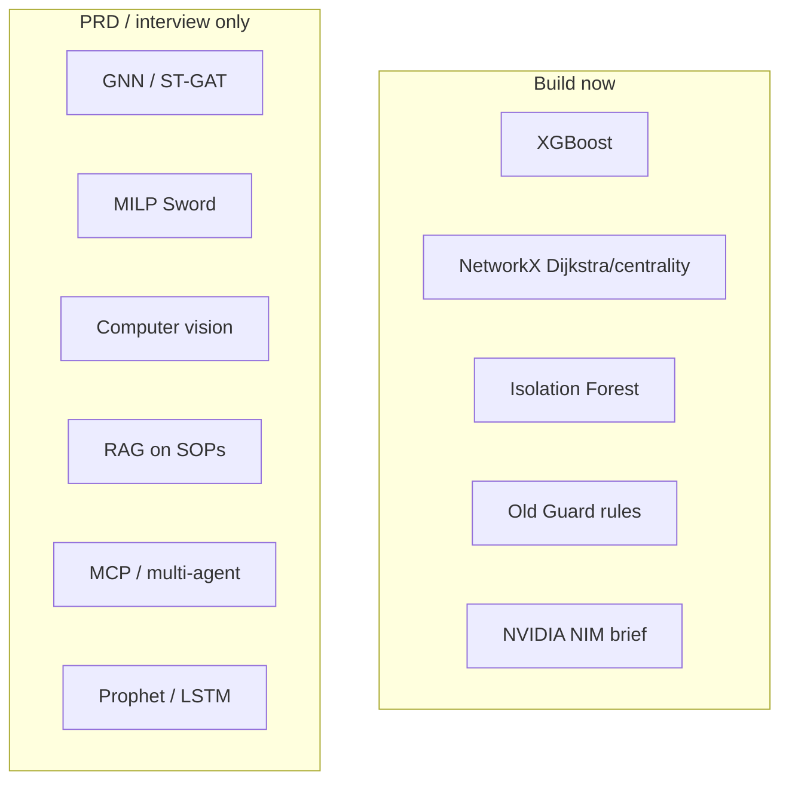

---

## Check me (remaining soft choices)

1. L1 stays **suggest-only** in the demo (locked) — confirm if you ever want auto-shed later.  
2. Devil’s Advocate LLM = **stretch** — build only if time.  
3. What-if slider + forecast chart = **in locked UI**; drop only if timeboxed.
