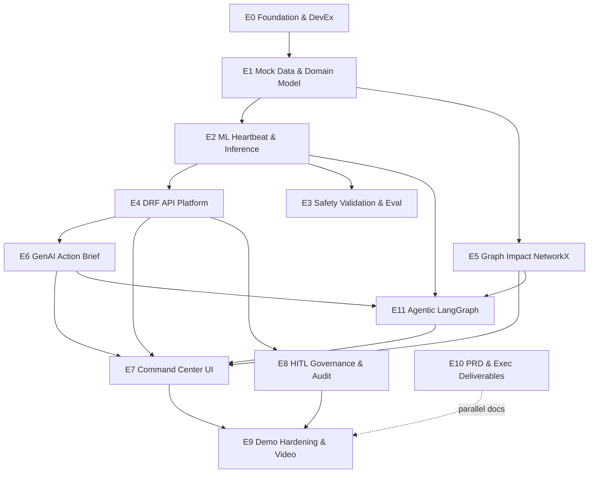

# AEGIS Prototype — Epic Backlog

**Product:** AEGIS (AI-Enabled Grid & Infrastructure Shield)  
**Client:** SGW (case)  
**Sources of truth:** `09-FINAL-LOCKED-DECISIONS.md` · `10-SYSTEM-DIAGRAMS.md`  
**Style:** Jira / ClickUp — Epics first; sprints & stories next  

---

## How to use this board

| Level | Meaning |
|-------|---------|
| **Epic** | Multi-day outcome you can demo or hand to PRD |
| **Sprint** | Time box (suggested below) that pulls stories from epics |
| **Story** | Implementable slice with clear Done criteria *(to be broken out next)* |

**Priority:** `P0` must ship for video demo · `P1` strong interview · `P2` stretch / PRD-only depth  

---

## Program goal

Ship a **working Shield prototype**: mock GIS/SCADA/weather → XGBoost risk → NetworkX impact → Old Guard conflict flags → **NVIDIA NIM** action brief → Streamlit Command Center → HITL shutdown with audit — plus README + 5–10 min video.

---

## Epic map (portfolio view)

---

## Sprint 1 stories (completed 2026-08-29)

| ID | Story | Status |
|----|-------|--------|
| S1-01 | Repo bootstrap (venv, Django, Streamlit, requirements) | Done |
| S1-02 | Mock `assets.csv` / `telemetry.csv` (~50 assets) | Done |
| S1-03 | Train XGBoost + `artifacts/xgb_risk.joblib` | Done |
| S1-04 | `GET /api/v1/assets/risk_map/` | Done |
| S1-05 | Streamlit Folium G/Y/R map | Done |
| S1-06 | README runbook | Done |

**Code home:** `c:\Users\ankit\Documents\AECOM-AEGIS-Case` (repo `New-Sheep/AECOM-AEGIS-Case`).

---

## Sprint 2 stories (completed 2026-08-29)

| ID | Story | Status |
|----|-------|--------|
| S2-01 | ORM models + dependencies.csv + `seed_aegis` | Done |
| S2-02 | Isolation Forest + `run_heartbeat` | Done |
| S2-03 | ValidationService + ConflictFlag | Done |
| S2-04 | NetworkX impact_count / downstream_ids | Done |
| S2-05 | Enriched `risk_map` API | Done |
| S2-06 | Streamlit conflict / hospital filter / downstream | Done |
| S2-07 | `backtest_storm.py` Recall + Lead-time | Done |
| S2-08 | README + backlog hygiene | Done |

---

## Sprint 3 stories (completed 2026-08-29)

| ID | Story | Status |
|----|-------|--------|
| S3-01 | AuditLog + ShadowLog + migrate | Done |
| S3-02 | NVIDIA/FAKE `llm.py` briefing client | Done |
| S3-03 | `action_brief` + `header` + `forecast` APIs | Done |
| S3-04 | `POST /control/shutdown/` → AuditLog | Done |
| S3-05 | Four-panel Streamlit Command Center | Done |
| S3-06 | Tests + README + backlog hygiene | Done |

**Code home:** `c:\Users\ankit\Documents\AECOM-AEGIS-Case` (repo `New-Sheep/AECOM-AEGIS-Case`).

---

## Sprint 4a stories (completed 2026-08-29)

| ID | Story | Status |
|----|-------|--------|
| S4a-01 | langgraph dep + `api/agent` state & nodes | Done |
| S4a-02 | LangGraph + MemorySaver interrupt/resume | Done |
| S4a-03 | DRF predict / impact / brief + agent run/resume | Done |
| S4a-04 | Streamlit weather-refresh + Manual Audit UI | Done |
| S4a-05 | Tests + README + docs/14 + E11 | Done |

---

## Suggested sprint cadence (draft — refine when we break stories)

| Sprint | Theme | Primary epics | Target outcome |
|--------|-------|---------------|----------------|
| **S0** | Bootstrap | E0, E1 (start) | Repo, Django/Streamlit skeleton, venv, README stub |
| **S1 — Day 1 slice** | 48-hour pipeline | E1, E2, E4 (thin), E7 (thin) | CSV → joblib XGB → `/risk` → Folium map markers **✅ DONE (2026-08-29)** |
| **S2** | Brain + safety | E2 complete, E3, E5 | Heartbeat, ValidationService, ConflictFlag, NetworkX impact **✅ DONE (2026-08-29)** |
| **S3** | Copilot + Command Center | E6, E7 full, E8 | action_brief, 4-panel UI, L1–L4 + AuditLog **✅ DONE (2026-08-29)** |
| **S4a** | Agentic LangGraph | E11 | Controlled Autonomy graph + nervous-system APIs **✅ DONE (2026-08-29)** |
| **S4b** | Ship | E9, E10 | Polish, video, PRD/exec drafts |

*(Sprints are proposals; next step is story breakdown per epic.)*

---

## EPIC E0 — Foundation & Developer Experience
**Goal:** Runnable monorepo so any story can land without re-plumbing.  
**Priority:** P0  

| Field | Value |
|-------|--------|
| **In scope** | Repo layout, Django project, Postgres/PostGIS (or Docker), Celery/Redis stubs, Streamlit app package, `.env.example`, lint/format basics |
| **Out of scope** | Production deploy, cloud OT |
| **Depends on** | — |
| **Demo / Done** | `docker compose up` or documented local run; empty DRF + empty Streamlit page load |

**Day-1 shortcut alignment:** Enables Steps 3–4 of the 48-hour plan.

---

## EPIC E1 — Mock Data & Domain Model
**Goal:** Unified SGW toy world: Big Three + lifeline dependencies.  
**Priority:** P0  

| Field | Value |
|-------|--------|
| **In scope** | `assets.csv` / `telemetry.csv` / weather fixtures; ~50 substations lat/lon; ORM models (Asset, Telemetry, WeatherContext, Dependency, AuditLog, ShadowLog); loaders into PostGIS; `scada_link_id` join |
| **Out of scope** | Live SCADA/NOAA |
| **Depends on** | E0 |
| **Demo / Done** | DB populated; Big Three types + ≥1 Hospital/WaterPlant dependency path queryable |

**Day-1 shortcut:** Step 1 — fake substations CSV first; ORM can follow same sprint.

---

## EPIC E2 — ML Heartbeat & Inference
**Goal:** Continuous (or on-demand) risk scoring pipeline.  
**Priority:** P0  

| Field | Value |
|-------|--------|
| **In scope** | Notebook train tiny XGBoost; `joblib` model artifact; `predict.py` / `InferenceService`; feature vector `[load, oil_temp, wind_speed, surge_level]`; Isolation Forest → `is_anomaly`; Celery task or management command for Heartbeat: Ingest → Normalize → Featurize → Infer → Persist `risk_score` |
| **Out of scope** | GNN, LSTM production training, live streaming |
| **Depends on** | E1 |
| **Demo / Done** | Re-run heartbeat updates `Asset.risk_score`; model loads in Django without retrain |

**Day-1 shortcut:** Step 2 — train + joblib before full Celery polish.

---

## EPIC E3 — Safety Validation & Evaluation
**Goal:** Old Guard + proof scripts; minimize false negatives.  
**Priority:** P0 (ValidationService) / P1 (backtest polish)  

| Field | Value |
|-------|--------|
| **In scope** | `ValidationService`; hard rules (surge>elevation ∧ wind>100; oil_temp>95°C); `conflict_flag`; confidence on stale/missing; optional KNN/neighbor stub; backtest script (Recall, Lead-time) on historical/mock storm CSV; ShadowLog hooks |
| **Out of scope** | Real Sandy data procurement if unavailable (synthetic OK with labeled assumptions) |
| **Depends on** | E2 |
| **Demo / Done** | Forced conflict case shows flag; backtest prints Recall + Lead-time |

---

## EPIC E4 — DRF API Platform
**Goal:** DRF as single source of truth for asset status.  
**Priority:** P0  

| Field | Value |
|-------|--------|
| **In scope** | Auth token stub; serializers with drivers, conflict_flag, confidence, impact_count, downstream_ids, replacement_cost; endpoints: `GET risk_map`, `GET action_brief`, `POST control/shutdown` (+ `action_level`); optional `GET header`, `GET forecast` |
| **Out of scope** | Real NERC CIP controls |
| **Depends on** | E1, E2 (for scores), E5 (for impact fields) |
| **Demo / Done** | curl/httpie returns map JSON; shutdown writes AuditLog |

**Day-1 shortcut:** Step 3 — thin `/api/v1/risk/` then rename/expand to locked contracts.

---

## EPIC E5 — Graph Impact (NetworkX)
**Goal:** Domino / lifeline impact without GNN.  
**Priority:** P0  

| Field | Value |
|-------|--------|
| **In scope** | Build graph from `Dependency`; centrality / Dijkstra as needed; `impact_count`; `downstream_ids` for path highlight; hospital/water filters |
| **Out of scope** | GNN/ST-GAT, full crew routing MILP |
| **Depends on** | E1 |
| **Demo / Done** | Clicking a substation yields non-empty downstream hospital/water list |

---

## EPIC E6 — GenAI Action Brief
**Goal:** Grounded executive Markdown from API facts.  
**Priority:** P0  

| Field | Value |
|-------|--------|
| **In scope** | **NVIDIA NIM** client (RedlineGuard pattern: `https://integrate.api.nvidia.com/v1`, `NVIDIA_API_KEY`, `meta/llama-3.1-8b-instruct`); prompt with risk, drivers, deps, trade-off ($ saved vs outage); cite telemetry/weather fields; ConflictFlag language; `FAKE_LLM=1` fallback |
| **Out of scope** | OpenAI API keys, RAG over SOP PDFs, MCP, multi-agent mesh |
| **Stretch** | Devil’s Advocate LLM pass |
| **Depends on** | E4, E5 |
| **Demo / Done** | `action_brief` returns Markdown that matches numeric risk in payload |

---

## EPIC E7 — Command Center UI (Streamlit)
**Goal:** Four-component Shield UX.  
**Priority:** P0  

| Field | Value |
|-------|--------|
| **In scope** | Header (threat, weather, impact, $ at risk); Folium/`st_folium` map G/Y/R + glow; path highlight; hospital filter; optional what-if surge; intelligence panel (brief + drivers + raw sensors + conflict banner); optional forecast chart |
| **Out of scope** | Native mobile field app |
| **Depends on** | E4, E5, E6 |
| **Demo / Done** | Full click path: map → brief → see trade-off → ready for action |

**Day-1 shortcut:** Step 4 — markers only first; then grow to 4 components.

---

## EPIC E8 — HITL Governance & Audit
**Goal:** Dead man’s switch + graduated response.  
**Priority:** P0  

| Field | Value |
|-------|--------|
| **In scope** | L1 suggest load-shed · L2 reroute suggestion · L3 gate messaging · L4 exec shutdown; trade-off confirm modal; mandatory reason; `authorization_token` stub; AuditLog; override → retrain flag |
| **Out of scope** | Real breaker actuation; auto-execute L1 |
| **Depends on** | E4, E7 |
| **Demo / Done** | L4 shutdown creates AuditLog row; UI refuses blank reason |

---

## EPIC E9 — Demo Hardening, README & Video
**Goal:** Assessor-ready prototype package.  
**Priority:** P0  

| Field | Value |
|-------|--------|
| **In scope** | Seed script one-command demo; README (setup, architecture, assumptions, limits); sample `.env`; 5–10 min video script + recording checklist; failure-mode screenshots (conflict, FN story) |
| **Out of scope** | Production SLA |
| **Depends on** | E7, E8, E3 (partial) |
| **Demo / Done** | Cold laptop → running demo in &lt;15 min from README |

---

## EPIC E10 — PRD & Executive Briefing (submission docs)
**Goal:** Deliverables 1 & 2 aligned to locked product (not copy of samples).  
**Priority:** P0 for submission timeline (can run parallel to build)  

| Field | Value |
|-------|--------|
| **In scope** | Full 9-section PRD (Shield + Sword roadmap, Big Three, AI stack, HITL); Exec briefing (value, $30M math, roadmap, governance, scale); sync numbers/assumptions with prototype |
| **Out of scope** | Building Sword optimizer |
| **Depends on** | Locked decisions (docs); prototype screenshots help but not required to start draft |
| **Demo / Done** | PDFs/Markdown ready to submit pre-interview |

---

## EPIC E11 — Agentic LangGraph (Controlled Autonomy)
**Goal:** Whiteboard state machine: Anomaly Shield interrupt → XGB → NetworkX → GenAI brief.  
**Priority:** P0 (interview / agentic narrative)  

| Field | Value |
|-------|--------|
| **In scope** | LangGraph graph; MemorySaver; nodes wrapping IF/XGB/NX/NVIDIA; nervous-system `predict`/`impact`/`brief`; `agent/run`+`resume`; Streamlit weather-refresh + Manual Audit |
| **Out of scope** | Devil’s Advocate LLM; Celery weather cron; Redis checkpointer |
| **Depends on** | E2, E5, E6 |
| **Demo / Done** | Force anomaly → interrupt → approve → action_plan in UI |

---

## Explicitly NOT an epic (roadmap only)

| Theme | Why deferred |
|-------|----------------|
| GNN / ST-GAT | Cursor lock: no deep nets in MVP |
| MILP crew restoration (Sword build) | PRD Phase 2–3 |
| RAG / MCP / multi-agent dispatch | Out of MVP GenAI scope |
| Live SCADA / DNP3 | Mock only |
| Computer vision drones | Roadmap |

---

## Day-1 → Epic traceability

| 48-hour step | Epic(s) |
|--------------|---------|
| 1 Mock CSV | E1 |
| 2 Train XGB + joblib | E2 |
| 3 Django risk API | E4 (+ E0) |
| 4 Streamlit + st_folium | E7 (+ E0) |

---

## Next step

Break **each epic into stories** (ID, description, acceptance criteria, story points / hours, sprint assignment), starting with **S1 Day-1 slice**: E1 → E2 → E4-thin → E7-thin.

Say the word and I’ll generate the full story backlog (ClickUp/Jira-ready table or CSV).
