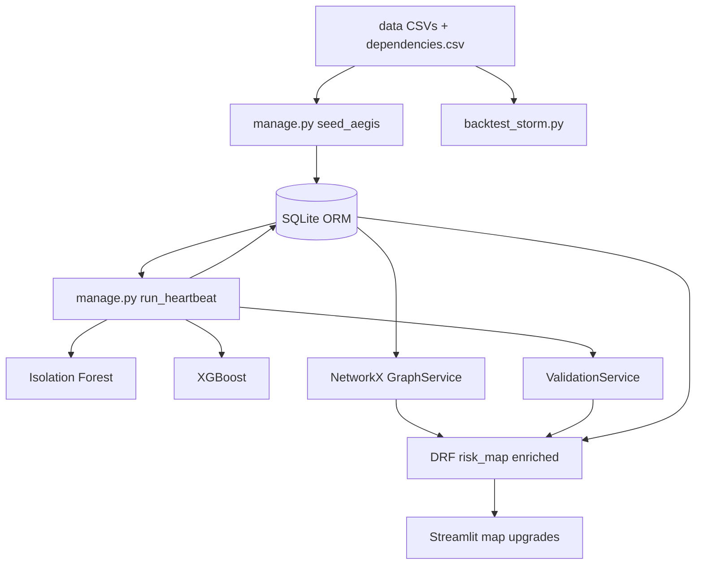

# AEGIS Sprint 2 — Brain + Safety + Graph Impact

**Status:** ✅ DONE (2026-08-29)  
**Code home:** `c:\Users\ankit\Documents\AECOM-AEGIS-Case`  
**Builds on:** Sprint 1 (CSV → XGBoost → `risk_map` → Folium)  
**Epics:** E1 (ORM/deps), E2 (Heartbeat + Isolation Forest), E3 (ValidationService), E5 (NetworkX), E4 (enriched API), E7 (thin UI upgrades)

---

## Goal

End of sprint demo:

```
CSV/ORM assets + dependencies
  → Heartbeat (management command): Isolation Forest + XGBoost + persist scores
  → ValidationService → conflict_flag + drivers + confidence
  → NetworkX → impact_count + downstream_ids (hospital/water)
  → enriched GET /api/v1/assets/risk_map/
  → Streamlit: ConflictFlag banner, path/downstream list, hospital filter
  → scripts/backtest_storm.py → Recall + Lead-time printed
```

**One-liner:** Risk map is no longer “score only” — it shows **safety conflicts** and **who goes dark** if an asset fails.

---

## Explicitly out of Sprint 2

| Deferred | Sprint |
|----------|--------|
| NVIDIA `action_brief` / LangChain-style brief | S3 |
| Four-panel Command Center (header, forecast chart, L1–L4 HITL, AuditLog UI) | S3 |
| Celery/Redis (use Django **management command** instead) | later |
| PostGIS (stay on **SQLite ORM** + CSV seed) | later unless needed |
| Devil’s Advocate LLM, RAG, MCP, GNN, MILP Sword | roadmap |

---

## Architecture



---

## Stories (implement in order)

### S2-01 — Domain model + seed (E1)

- Django models: `Asset`, `Telemetry`, `WeatherContext`, `Dependency` (fields per lock batch 2 + elevation/confidence/replacement_cost)
- `data/dependencies.csv` (parent → child; at least Transformer/Switchgear → Hospital and → WaterPlant/Pump)
- `python manage.py seed_aegis` loads CSVs into SQLite
- Keep CSV files as source for regenerate; ORM becomes API source of truth after seed

**Done:** `Asset.objects.count() == 50`; ≥1 hospital and ≥1 water dependency queryable.

### S2-02 — Isolation Forest + Heartbeat command (E2)

- Fit/save `artifacts/isolation_forest.joblib` (or fit on seed telemetry in train script)
- Flag `Telemetry.is_anomaly`; on anomaly use last-known-good or mark low confidence (document choice)
- `InferenceService` (or module): featurize → XGB → write `Asset.risk_score`
- `python manage.py run_heartbeat` runs: Ingest/normalize (from DB) → Featurize → Infer → Persist
- Optional: top-3 **drivers** via XGB feature importance × instance values (simple attribution OK)

**Done:** Re-running heartbeat updates `risk_score` / `is_anomaly` in DB without retraining XGB from scratch.

### S2-03 — ValidationService + ConflictFlag (E3)

Hard rules (locked):

```
IF surge_level > elevation AND wind_speed > 100 → physics Failure / CRITICAL
IF oil_temp > 95 → High/Critical thermal
```

- Compare physics vs XGB: if physics Failure and XGB risk &lt; 0.3 (Safe) → `conflict_flag=True`
- Persist or compute-on-read: `conflict_flag`, `confidence` (drop if stale/missing/anomaly)
- Unit tests: forced conflict fixture

**Done:** At least one seeded asset returns `conflict_flag: true` on `risk_map`.

### S2-04 — NetworkX graph impact (E5)

- Build directed graph from `Dependency`
- For each asset: `impact_count`, `downstream_ids` (BFS/DFS successors)
- Centrality optional stretch; Dijkstra not required unless used for path list
- Wire into `risk_map` serializer

**Done:** Clicking/selecting a substation in UI shows non-empty downstream hospital/water when edges exist.

### S2-05 — Enrich `GET /api/v1/assets/risk_map/` (E4 thin+)

Each asset payload adds (beyond S1):

- `type`, `drivers` (top-3), `conflict_flag`, `confidence`
- `impact_count`, `downstream_ids`
- `replacement_cost` (for later $ rollup)

Still no `action_brief` / shutdown in S2.

**Done:** curl shows new fields; `impact_count` not always 0.

### S2-06 — Streamlit UI upgrades (E7 thin+)

- ConflictFlag banner / red outline on conflict markers
- Sidebar: drivers, confidence, downstream list
- Filter: “Hospital-linked only”
- Optional: draw simple polylines if lat/lon available for downstream (nice-to-have)

**Done:** Demo path: open map → filter hospital-linked → select conflict asset → see flag + downstream.

### S2-07 — Backtest script (E3)

- `scripts/backtest_storm.py` on labeled mock/historical-style CSV (synthetic OK)
- Print **Recall** and **Lead-time** (define lead-time clearly in script docstring)
- Document FN-minimization goal in script header

**Done:** Script exits 0 and prints both metrics.

### S2-08 — Docs hygiene

- Update README (seed, heartbeat, backtest commands)
- Mark S2 stories Done in `docs/11-EPIC-BACKLOG.md`
- Commit/push only when asked

---

## Acceptance criteria (sprint)

- [ ] `seed_aegis` + `run_heartbeat` documented and working
- [ ] `risk_map` includes `conflict_flag`, `drivers`, `confidence`, `impact_count`, `downstream_ids`
- [ ] ≥1 conflict demo asset; ≥1 asset with lifeline downstream
- [ ] Streamlit shows conflicts + hospital filter + downstream list
- [ ] `backtest_storm.py` prints Recall + Lead-time
- [ ] Still no OpenAI; NVIDIA still not required

---

## Effort guide

Roughly **1–2 focused days**. Order is strict: models/seed → heartbeat/IF → validation → graph → API → UI → backtest.

---

## After Sprint 2

**Sprint 3:** NVIDIA `action_brief`, four-component Command Center, L1–L4 HITL + AuditLog, trade-off modal.
