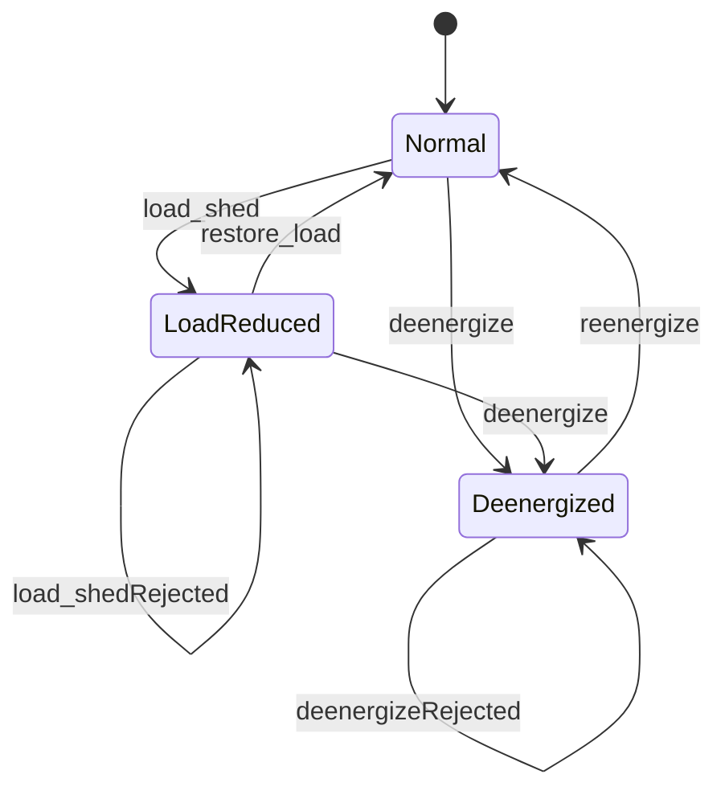

# 16 — Operator UX, Control Lifecycle & Dynamic Simulation

**Status:** Research + product decisions (implementation deferred until approved)  
**Code home:** AEGIS Command Center (`frontend/`, `backend/api/`)  
**Related:** [`00-AEGIS-NORTH-STAR.md`](00-AEGIS-NORTH-STAR.md) · [`09-FINAL-LOCKED-DECISIONS.md`](09-FINAL-LOCKED-DECISIONS.md) · [`15-DATA-PROVENANCE.md`](15-DATA-PROVENANCE.md)

This note answers four operator questions that showed up during demo use:

1. Which header chrome is actually necessary?
2. Why can operators keep clicking **Shut down** / **Reduce load** after the site is already acted on?
3. How does an exec **restore load** or **undo shut down**?
4. Why does the UI go “dead” once all red dots are cleared — and how do we simulate a **living** storm for video?

---

## 1. Problem statement

### 1.1 Chrome clutter vs situation awareness

The top of the Command Center currently stacks:

- Brand: `AEGIS` · Shield · Southeastern Grid & Water  
- Health: `API ONLINE`  
- Mode: `Active emergency · service territory`  
- Queue: `No sites need a decision` (or `N sites need a decision`)

Some of that is essential for an incident commander; some is engineer/dev chrome that competes with the decision queue and KPIs.

### 1.2 Non-idempotent controls

`POST /api/v1/control/shutdown/` accepts repeated `load_shed` / `deenergize` for the same asset. Map quick actions and the HITL form never disable. Operators can submit **Shut down** with a trivial reason after load is already `0`, producing new `AuditLog` rows (`0.00 → 0.00`) while the UI still looks fully actionable.

### 1.3 No restore path

North star is **predict → protect → restore**. Today the UI only offers protective actions (reduce / reroute / shut down). There is no first-class **restore load** or **re-energize** after demo OT.

### 1.4 Static post-clearance demo

Once every `conflict_flag` is cleared, the banner goes green and the map looks “under control.” Real emergencies are not a single static CSV frame: wind, surge, and asset stress evolve. A frozen mock kills the story for a 5–10 minute assessor video.

---

## 2. Research notes (external practice)

### 2.1 What counts as an alarm

**ANSI/ISA-18.2** and **EEMUA Publication 191** treat an alarm as a signal that:

- indicates an **abnormal** condition, and  
- **requires operator action** to prevent a defined consequence.

Priorities are typically **3–4 levels** (e.g. Critical / High / Medium / Low), set by **consequence severity × time to respond**. Guidance commonly used in industry summaries: keep high-priority alarms rare (often cited ~5% of configured alarms), avoid alarm floods, and distinguish alarms from status/informational noise.

Implications for AEGIS:

- **Sites needing a decision** (`conflict_flag`) = real alarm-class queue.  
- Network-wide **Threat** (wind / high-risk counts) = situational severity, not the same as “act on this site now.”  
- “API ONLINE” is **health status**, not an alarm.

### 2.2 Color and “dull screen” HMIs

**ISA-101** high-performance HMI practice and **NUREG-0700** (NRC Human-System Interface Design Review Guidelines) emphasize:

- Consistent coding; color used **sparingly** for abnormal states.  
- “Dull screen” patterns: greys for normal process; **yellow/amber** for off-normal; **red** reserved for highest urgency / alarm so it stays salient.

Implications for AEGIS:

- Map dots already approximate Low / Watch / High / Needs attention — keep that spectrum, but reserve the strongest red/pulse for **decision-needed**.  
- Do not paint the whole chrome critical just because wind is high.

### 2.3 Auditory alarms (human factors)

Human-factors literature on control-room and safety alarms (e.g. Liv Systems HF design notes; IEC 60601-1-8-style urgency coding research; SINTEF HF alarm-sound work) converges on:

- Prefer **learnable, urgency-coded** short tones over continuous sirens/buzzers that get ignored or stress operators.  
- Harmonically richer sounds are easier to detect/localize than pure tones.  
- Urgency should map to **required response**, not to “make it loud.”  
- Always provide **acknowledge / mute**; never leave a looping police-siren on an assessor laptop.

Implications for AEGIS demo:

- Soft **burst on new attention flag** only; optional soft chime when Threat escalates.  
- Default **Mute alarms** available; never continuous siren.

### 2.4 Load shed and restoration (utilities)

Commercial and ISO practice treat shed and restore as a **paired lifecycle**:

- **Oracle Utilities NMS** documents a Load Shed and Restoration tool: shed and restore times, ranked load groups, SCADA vs manual steps.  
- **ISO New England** procedures (e.g. CROP load shed / restoration guidance, MLCC restoration notes) emphasize **incremental** restore, monitoring frequency/voltage, and coordinated instructions — not slamming full load back instantly.

Implications for AEGIS demo MVP:

- Add `restore_load` and `reenergize` as audited actions.  
- Restore toward a **safe baseline**, not necessarily “instant max.”  
- Do not auto-recreate `conflict_flag` on restore; the **scenario clock** may raise new conflicts as weather evolves.

### 2.5 Living emergency dashboards (demo systems)

Hackathon / EOC-style demos (e.g. CrisisFlow / CityNerve patterns: Open-Meteo refresh + simulation endpoints; Sentinel-style “start emergency simulation”) keep:

- a **simulation clock** or phase,  
- periodic weather/telemetry refresh,  
- explicit **start / reset scenario** for recording.

Static CSVs are fine as a **seed**; they should not be the **runtime truth** for the whole demo.

---

## 3. Chrome necessity — keep / demote / drop

| Element | Necessity | Decision |
|---------|-----------|----------|
| **AEGIS** + Shield · SGW | Brand / product identity | **Keep** as hero-level brand in header |
| **API ONLINE / DOWN** | Engineer health, not IC situation | **Demote** — muted chip or sidebar Advanced only; remove from primary strip when API is healthy |
| **Active emergency · service territory** | Mode / context (event-agnostic) | **Keep one line** — drop if it duplicates the Storm/scenario KPI |
| **N sites need a decision / No sites…** | Operator queue (`conflict_count`) | **Keep** — primary attention signal next to brand |
| Duplicate storm name in scenario chip **and** Storm KPI | Redundant | **Pick one** — prefer KPI for storm/scenario name; scenario strip for mode + queue only |

**First-viewport target:** brand + decision-queue chip (+ optional muted mode line). Threat / wind / flood / $ at risk stay in the KPI row, not as extra header prose.

---

## 4. Control lifecycle — idempotent protect actions

### 4.1 Site operational state

Derive (or store) a per-site control state:

| State | Meaning (demo) | How we know |
|-------|----------------|-------------|
| `normal` | Energized; load not intentionally shed by AEGIS | Default / after restore |
| `load_reduced` | Demo L1 applied | Last successful `load_shed`; load below baseline |
| `deenergized` | Demo L4 applied | Last successful `deenergize`; load ≈ 0 |

### 4.2 Backend rules (P0)

On `POST /api/v1/control/shutdown/` (or a renamed control endpoint):

| Request | If current state… | Response |
|---------|-------------------|----------|
| `load_shed` | `load_reduced` or `deenergized` | **409** (or 400) — already applied; no new fake OT effect |
| `deenergize` | `deenergized` | **409** — already shut down |
| `deenergize` | `load_reduced` | **Allow** — escalate protect |
| `restore_load` / `reenergize` | see §5 | Allow when valid |

Always write `AuditLog` for **accepted** transitions only. Rejected duplicates must not look like successful OT.

Optional persistence: `Asset.operational_state` + `baseline_load` (or derive from latest telemetry + last accepted AuditLog). Prefer an explicit field for demo clarity.

### 4.3 UI disable / fade rules (P0)

When selected site is `load_reduced`:

- Fade/disable **Reduce load** (map + HITL radio + Ask Confirm).  
- Keep **Shut down** available (escalate).  
- Show chip: `Load reduced (demo)`.

When selected site is `deenergized`:

- Fade/disable **Reduce load** and **Shut down**.  
- Show chip: `Shut down (demo)`.  
- Surface **Restore** actions (§5).

HITL form: hide or disable radio options that are illegal for current state; do not leave a bright primary **Submit action** that only creates duplicate audits.

Ask AEGIS: if suggested action is already applied, reply with status + restore options; **no** pending Confirm for the same write.

---

## 5. Restore / re-energize

| Action | Effect (demo) | Auth | From states |
|--------|---------------|------|-------------|
| `restore_load` | Raise load toward stored baseline (e.g. undo ~20% shed in one step, or stepwise) | Ops token (`AEGIS-OPS`) | `load_reduced` → `normal` |
| `reenergize` | Load from ~0 → safe restore target (baseline or conservative fraction) | Exec token (`AEGIS-EXEC-DEMO`) | `deenergized` → `normal` |

Rules:

- Both require `reason_text` and write `AuditLog` / `ShadowLog` like protect actions.  
- Do **not** auto-set `conflict_flag=True` on restore.  
- Map UI: when deenergized/load_reduced, primary buttons become **Restore load** / **Re-energize** (clear labels), not a second Shut down.  
- Incremental restore can be a later polish; MVP may restore to baseline in one audited step with caption “demo restore — real grids restore in stages.”

This closes the north-star loop: protect **and** restore.

---

## 6. Dynamic scenario simulation

### 6.1 Design intent

Seed CSVs (Ian / SW Florida) remain the **case-study dataset**. Runtime behavior should feel like continuous monitoring:

- Weather and sensors **drift**.  
- New sites can enter the **decision queue** after earlier ones were cleared.  
- Operator can **reset** the scenario for a clean video take.

### 6.2 Scenario clock (hackathon-sized)

Expose on header (and optionally assets):

| Field | Example | Role |
|-------|---------|------|
| `sim_phase` | `approach` → `peak` → `landfall` → `aftermath` | Narrative + severity profile |
| `sim_tick` | integer | Monotonic tick for UI “live” feel |
| `sim_time_label` | `T+02:15` | Operator-facing clock |

`POST /api/v1/scenario/tick/` (or heartbeat extension):

1. Advance tick / maybe phase on a schedule.  
2. Nudge `WeatherContext` wind/surge (bounded random walk or phase curve).  
3. Nudge selected telemetry (oil_temp / load) lightly.  
4. Re-evaluate physics vs score; **re-flag** a rotating coastal subset when surge/wind exceed thresholds (so the queue can refill).  
5. Optionally re-run risk score slice (or lightweight heuristic) without full retrain.

Frontend: Streamlit auto-refresh or `st.fragment` every **15–30s** while “Live monitoring” is on. Sidebar: **Pause sim** · **Tick once** · **Demo reset** (reseed conflicts + phase).

### 6.3 Demo video script fit

1. Start at `peak` with 1–2 attention sites.  
2. Operator clears them (idempotent UI shows state).  
3. Tick advances → new attention site or Threat rises → optional soft alarm.  
4. Exec restores an earlier site.  
5. Reset for take two.

---

## 7. Alarm sound + color spectrum

### 7.1 Priority map (AEGIS)

| Priority | Source | Visual | Sound |
|----------|--------|--------|-------|
| **P1 — Decision needed** | `conflict_flag` | Distinct attention color + optional pulse on map/banner | Short urgent burst **once** when flag becomes new |
| **P2 — High site risk** | `risk_score` high, no conflict | Red/orange dot | Silent (or very soft) unless Threat also escalates |
| **P3 — Watch / Elevated threat** | Header threat `ELEVATED` / `WATCH` | Amber KPI / caption | Optional soft chime on **Threat escalate** only |
| **P4 — Normal / monitor** | Stable site | Neutral / green low | Silent |

Ack/mute:

- **Mute alarms** toggle (session).  
- Optional **Ack attention** clears sound without clearing the flag (ISA-style annunciator ack).  
- Never continuous siren.

### 7.2 Implementation sketch (later)

- Web Audio or short packaged WAV in Streamlit custom component / `components.html`.  
- Track `last_seen_conflict_ids` in `st.session_state` to fire sound only on set-diff.  
- Respect assessor environments: default muted or soft volume.

---

## 8. Phased backlog

### P0 — Control integrity (ship before more spectacle)

- [x] Derive/store `operational_state` + baseline load  
- [x] Reject duplicate `load_shed` / `deenergize` with clear errors  
- [x] Disable/fade illegal map + HITL + Ask Confirm controls  
- [x] Add `restore_load` + `reenergize` (auth + AuditLog)  
- [x] Status chips on selected site  

### P1 — Living scenario

- [x] `sim_phase` / `sim_tick` on header  
- [x] `tick_scenario` (or heartbeat) mutates weather/telemetry + may reflag  
- [x] Auto-refresh / Live monitoring toggle  
- [x] Demo Reset  

### P2 — Alarms & HMI spectrum

- [ ] New-flag sound + mute  
- [ ] Threat-escalate soft chime  
- [ ] Pulse/attention styling reserved for decision queue  
- [x] Demote API ONLINE from primary chrome
### P3 — Polish

- [ ] Incremental multi-step restore  
- [ ] Scenario phase jump UI for video directors  
- [ ] Align About copy with live-sim behavior  

---

## 9. Acceptance criteria (future demo video)

- [ ] Header shows brand + decision queue without fighting the KPI row; API health is not the loudest chip when healthy.  
- [ ] After Shut down, Shut down / Reduce load are clearly unavailable; Restore / Re-energize are available.  
- [ ] Repeated submit of the same protect action does not create a successful “0→0” OT story.  
- [ ] Clearing all flags is not a dead end: within one tick window (or Demo Reset), conditions or queue can change again.  
- [ ] If sound is enabled, only **new** decision-needed events (and optionally Threat escalate) make noise; mute works.  
- [ ] Restore path is visible in Audit history like protect actions.

---

## 10. Sources (starting points)

| Topic | Reference |
|-------|-----------|
| Alarm philosophy / priorities | ANSI/ISA-18.2 summaries; EEMUA 191 (Alarm Systems) |
| HMI color / dull screen | ISA-101 practice; NUREG-0700 HSI guidelines; INL digital HMI color guidance examples |
| Auditory HF | Liv Systems “Setting the Right Tone”; IEC 60601-1-8 urgency-coding research; SINTEF HF alarm sound notes |
| Shed / restore | Oracle Utilities NMS Load Shed and Restoration docs; ISO-NE load shed/restoration operating procedures |
| Living EOC demos | Patterns from Open-Meteo-backed crisis dashboards and explicit “start simulation” flows (e.g. CrisisFlow / CityNerve / Sentinel-style demos) |

---

## 11. Decision summary (locked for next build)

1. **Chrome:** Keep brand + decision-queue; demote API ONLINE; one mode line max.  
2. **Controls:** Stateful site machine; reject duplicate protect actions; disable illegal UI.  
3. **Restore:** First-class `restore_load` / `reenergize` with audit — completes protect → restore.  
4. **Dynamics:** Scenario clock + tick/reflag + refresh + Demo Reset — Ian data stays seed, not a frozen product identity.  
5. **Alarms:** Short, ackable, muted-by-default-friendly tones; red/pulse reserved for decision-needed — not a carnival siren.

*End of doc — implementation starts only after explicit approval of a build pass.*
