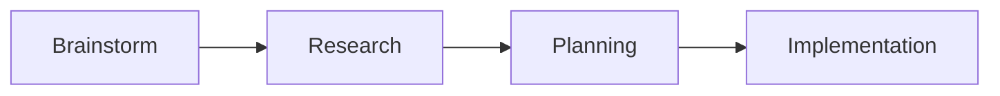
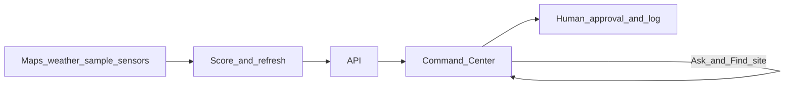

# Prototype and PRD Handover - AEGIS

**Audience:** AECOM assessors, interview panel, and candidate (Ankit)  
**Prototype status:** LOCKED. No further feature work for this submission.  
**Repo:** https://github.com/New-Sheep/AECOM-AEGIS-Case  

This note explains **how the solution was developed**, what shipped, how to run the demo, and what comes later. Language matches the case brief: short sentences, everyday words.

---

## How this solution was developed

| Stage | What happened | Where to read |
|-------|---------------|---------------|
| **Brainstorm** | The client brief was incomplete. Gaps were named. A domain expert helped with floods, heat, substations, and water plants. | `01`, `02` |
| **Research** | Utility map systems, sensor feeds, weather, and field tools sit in silos. Power loss cascades into water and hospitals. Protect first, then restore. | `05`-`08`, `00` |
| **Planning** | Locked one operator workflow, a small first stack, and what ships later. | `09`, `11` |
| **Implementation** | Built a working Command Center with sample data. A person must approve protect actions. Prototype is frozen for submission. | This repo + README |

**Shield** = protect critical equipment before it is destroyed.  
**Sword** = restore power and water fairly after the storm. Sword is planned later. It is not in this code.

---

## 1. Submission package

| Deliverable | File |
|-------------|------|
| D1 Product Requirements | [`DELIVERABLE-1-PRD-AEGIS.md`](DELIVERABLE-1-PRD-AEGIS.md) |
| D2 Executive briefing | [`DELIVERABLE-2-EXECUTIVE-BRIEFING-AEGIS.md`](DELIVERABLE-2-EXECUTIVE-BRIEFING-AEGIS.md) |
| D3 Prototype | Code + [`../README.md`](../README.md) (locked) |
| D3 Video script | [`DELIVERABLE-3-VIDEO-DEMO-SCRIPT.md`](DELIVERABLE-3-VIDEO-DEMO-SCRIPT.md) (record separately) |
| Assignment brief | [`01-technical-assessment-brief.md`](01-technical-assessment-brief.md) |
| Data honesty | [`15-DATA-PROVENANCE.md`](15-DATA-PROVENANCE.md) |
| Brief vs submission gaps | [`19-GAP-ANALYSIS-BRIEF-VS-SUBMISSION.md`](19-GAP-ANALYSIS-BRIEF-VS-SUBMISSION.md) (gap-fill applied) |

Research digests (`00`, `02`, `05`-`09`, `16`-`17`) informed decisions. Samples `03` and `04` are tone practice only, not the submission.

---

## 2. What was built vs what comes later

| Capability | In the prototype (Shield) | Later (not in this code) |
|------------|---------------------------|--------------------------|
| Risk scores | Tree model with clear drivers; safety rules can override calm scores | Longer forecast windows |
| Odd sensor readings | Separate “sensor looks wrong” check | More sensor channels |
| Knock-on impact | Simple dependency graph (who fails next) | Richer network learning when true topology exists |
| Plain-language brief | Language model phrases answers from real fields | More helpers |
| Control | Reduce load / shut down / restore only after human approval and a written reason | Still never unsupervised |
| Fair restoration (Sword) | Not built | Crew and spare plans that put hospitals, water, and vulnerable places first |
| Live utility sensors | Public maps and weather plus honest sample sensor patterns | Live read-only feeds in a sponsored pilot |
| Heat / wildfire depth | Vision only; storm case study is primary | Hazard feature packs on the same Command Center |
| Production cyber / CIP evidence | Design posture only | Hardened pilot |

**Product call:** Shield first, Sword second. The prototype proves **situational awareness** and **human-approved protection**. It does not claim autonomous restoration.

---

## 3. Gaps named on purpose (interview)

| Topic | Honest answer |
|-------|---------------|
| Multi-hazard | Brief lists hurricane, flood, heatwave, wildfire. Demo is **coastal flood/wind first**. Oil temp is equipment, not heatwave ambient. |
| Emergency coordination | Phase 1 = shared map, ranked sites, impact, brief, audit handoff. Not full dispatch or mutual aid. |
| Insurance / lawsuits | Board sketches in the exec briefing; not a premium model in code. |
| Architecture | Mermaid context + inference diagrams live in the PRD §6 (also research `10`). |
| Compliance | US CIP / PUC design posture; UK GDPR / AI assurance for reuse. Prototype is not certified. |
| Cyber misuse | No write path into switching by design; demo token is not production security. |
| Plug-in | Adapters + read-only mirror; AEGIS does not replace systems of record. |

---

## 4. End-to-end workflow

**Operator loop**

1. Header shows active emergency, high-risk count, and how many sites need a decision.  
2. Map (and Find site) shows prioritized sites.  
3. Select a site. Read Summary, Readings, and Why this score.  
4. Optional: Ask AEGIS (for example Site priority list, then Open to jump).  
5. Confirm Reduce load or Shut down with a reason and an auth token.  
6. The audit log and map counts update.

---

## 5. Key choices (defend in interview)

| Decision | Why, in plain words |
|----------|---------------------|
| Shield before Sword | You cannot restore a hospital if the equipment that feeds it is already destroyed. |
| Storm case study first | Honest public weather + cascade-to-water demo; heat/fire reuse the same loop later. |
| Tree risk model first | Tabular features, readable drivers; richer graph models need true network history we do not have. |
| Simple impact graph | Explicit “feeds” edges; easy to explain who fails next. |
| Separate sensor check | Weather risk and “sensor looks wrong” are different trust problems. |
| Django API as source of truth | Assets, audit, seed, and refresh in one place. |
| Streamlit Command Center | Fast proof for the case. Not claimed as a production control-room screen. |
| Human approval only | Liability, critical-infrastructure security story, and operator trust. |
| Hybrid sample data | Real public maps and weather plus sample sensor patterns. Never claim live SGW control-room feeds. |
| Offline language mode by default | Reliable demo without a cloud key; live language service optional. |

---

## 6. Compliance one-pager (interview)

| Followed in design | Planned in pilot | Missing in prototype |
|--------------------|------------------|----------------------|
| Advisory only; human approve; audit; read-only sensor mirror; grounded language | Enterprise identity; dual control; shadow evidence; DPIA if personal data appears | Production CIP stamp; hardened perimeter; formal red-team |

US primary for SGW (CIP design posture, state commission prudence, water emergency cascade). UK named for AECOM reuse (data protection, AI assurance, energy ethical AI expectations).

---

## 7. How to run (summary)

Full commands: repo [`README.md`](../README.md).

1. Migrate → seed → diversify demo map → run heartbeat.  
2. Start the API on port 8000.  
3. Start the Command Center with `AEGIS_API_BASE` pointing at the API.  
4. Keep offline language mode on for a reliable recording (`FAKE_LLM=1` in `.env`).

**Golden demo path (video):** Find site or map → open a high-risk site → Summary → human-approved protect action → Ask → Site priority list → Open another site.

---

## 8. Scrappy but intentional

Expect demo roughness: search may need a click outside the box before filters apply; risk bands are spread for a readable map story; sensor patterns are sample-based. Assess **solution engineering and product judgment**, not production polish. The case brief values clarity and prioritization over finished production systems.

**Say on camera:**

- Not live SGW control-room sensors  
- Dependencies are inferred, not true breaker diagrams  
- Sword is not implemented  
- Storm case study first; heat and fire are roadmap packs  
- No production security certification for critical infrastructure  

---

## 9. Interview one-pager

**Problem:** Map systems, sensors, weather, and field tools do not form one picture. Blindness leads to destroyed equipment, insurance and regulatory pressure, and slow, unfair restoration.  
**Insight:** Protect first. Restore fairly later. Storm demo first; multi-hazard later.  
**Solution:** AEGIS advisory Command Center. Score risk, show knock-on impact, brief in plain English, human authorizes protect actions. Coordinates emergency **attention** with a shared log.  
**Money (demo estimates):** ~$152M replacement on the demo map; ~$27M transformers; stress case ~$20–35M if 8–10 transformers lost; one avoided ~$3M unit can justify a Phase 2 pilot. Full KPIs and Leadership FAQ: [`DELIVERABLE-2-EXECUTIVE-BRIEFING-AEGIS.md`](DELIVERABLE-2-EXECUTIVE-BRIEFING-AEGIS.md).  
**Beyond chatbots:** Risk model, sensor check, impact graph. Language model only phrases grounded answers. Sword crew planning comes later.  
**Ask:** Approve Phase 1 situational awareness. Sponsor Phase 2 live read-only pilot. Keep fair restoration and heat/fire packs on the later roadmap.
