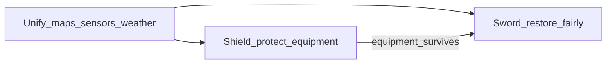
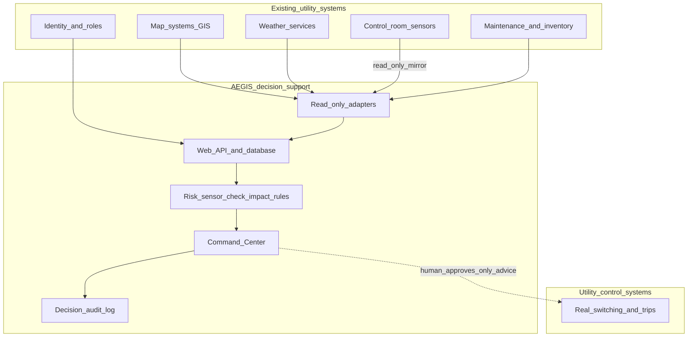
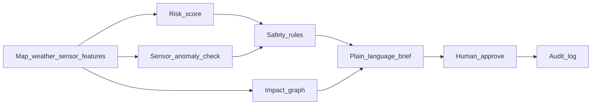

# Product Requirements Document - AEGIS

**Product:** AEGIS (AI-Enabled Grid and Infrastructure Shield)  
**Client:** Southeastern Grid and Water (SGW), fictional utility for this case  
**Author:** Ankit  
**Purpose:** AECOM AI Solution Engineer submission (Deliverable 1)  
**Prototype:** Locked in the code repository (no further feature work)

This is the submission PRD. The file `04-sample-prd-aegis.md` is only a structure sample.  
Gap-fill against the case brief is tracked in `19-GAP-ANALYSIS-BRIEF-VS-SUBMISSION.md`.

---

## How this solution was developed

The case brief says the client context is incomplete on purpose. Clarity and prioritization matter more than a perfect production system. Here is how the work was done.

| Stage | What I did |
|-------|------------|
| **1. Brainstorm** | Listed what was missing. Named clear assumptions. Spoke with an electrical domain expert about floods, heat, substations, and water treatment plants. |
| **2. Research** | Mapped how map systems, sensor systems, weather feeds, and field tools fail to connect. Traced how a power failure can stop pumps and hurt hospitals. |
| **3. Planning** | Chose one main goal first: **protect critical equipment before it is destroyed** (Shield). Put **fair restoration after the storm** (Sword) on the later roadmap. Locked one operator workflow and a simple tech stack. |
| **4. Implementation** | Built a working Command Center with sample data, risk scores, a map, plain-English briefs, and actions that always need a human to approve. |

**Two product names used throughout**

- **Shield:** protect critical equipment before it is destroyed.  
- **Sword:** restore power and water fairly after the storm (planned later, not built in the prototype).

You cannot restore a hospital if the transformer that feeds it is already destroyed. That is why Shield comes before Sword.

---

## 1. Problem Definition and Business Context

### Client overview

Southeastern Grid and Water serves **over 8 million residents** across coastal and inland regions. The brief lists four hazard families: **hurricanes, flooding, heatwaves, and wildfires**.

Assets include:

- Substations  
- Transmission networks  
- Water treatment facilities  
- Pumping stations  

The utility faces rising operating costs, more service disruptions, **growing insurance premiums**, and **increasing regulatory pressure** on climate resilience and emergency preparedness.

### Case-study honesty (multi-hazard)

The product vision is multi-hazard. The locked prototype and demo narrative are biased to a **coastal flood and wind case study** (Hurricane Ian–style Southwest Florida corridor).

| Hazard in the brief | In this prototype | Later |
|---------------------|-------------------|-------|
| Hurricane / flood | Primary demo: wind, surge, elevation, flood safety overrides | Deepen forecasts |
| Heatwave | Equipment oil temperature and load exist as features; **not** a full ambient heatwave story | Ambient stress and load-peak feature pack |
| Wildfire | Named in vision only | Fire-weather indices and public-safety shutoff–style protect workflow |

“Temperature” in today’s risk model is largely **equipment oil temperature**, not outdoor heatwave air temperature or wildfire weather. The same score → impact → human-approve loop should later reuse the Command Center with different hazard feature packs. That is a deliberate prioritization, not a claim that heat and fire are equally demoed.

### The challenge

AECOM was asked to help modernize resilience with an **AI-enabled decision support platform**.

Today, operational data is split across:

- Map systems (GIS)  
- Maintenance platforms  
- Weather feeds  
- Field operations tools  

That split makes it hard to:

- Spot infrastructure risk early  
- Coordinate emergency response  
- Give leaders a clear live picture during severe weather  

In practice, three things go wrong:

1. **Leaders cannot see one trusted picture** of which sites are in trouble and what fails next.  
2. **Expensive, hard-to-replace equipment is lost** (for example large transformers with no spare) because warning comes too late.  
3. **After the storm, recovery can be slow or unfair**, leaving hospitals, water plants, and vulnerable neighborhoods offline too long.

Domain input also stressed that disasters stack: lost power, lost communications, lost road access, and several assets failing together. Flood and wind hit sites differently from extreme heat. Power loss often cascades into water and pump failures, then into public health risk.

### Problem statement

How can SGW connect its data so it can predict risk hours ahead, protect equipment that cannot be quickly replaced, and later restore service fairly, while **people always stay in control of turning equipment on or off**?

### Why this matters (direct and indirect)

- Replacing a large transformer can take many months and cost millions.  
- At the scale of **8 million customers**, indirect pressure matters as much as scrap metal cost: insurance and liability conversations, regulatory scrutiny of preparedness, lawsuit and brand risk after unfair or opaque recovery, and wasted overtime when emergency desks do not share one picture.  
- Regulators and the public care that decisions are documented and fair, not only that “some lights came back.”  
- The product is decision support. It does not replace the utility’s control systems, and it does not flip switches on its own.

---

## 2. Key Assumptions and Unknowns

| Type | Item | Working assumption | If wrong |
|------|------|--------------------|----------|
| Assumption | Sensor coverage | Major sites have usable sensor readings (or we can use honest sample data) | Use neighboring sites or sample data and show lower confidence |
| Assumption | Maps | We know where assets are and roughly how high they sit | Infer links from nearby locations and label them as inferred |
| Assumption | Control | AI only advises. A person must approve any protect or restore action | Fixed rule for liability and trust |
| Assumption | Hazards | First case study is coastal flood/wind; heat and fire reuse the same loop later | Do not pretend the prototype is a heatwave or wildfire product |
| Assumption | Integration | Enterprise systems connect through adapters and a read-only sensor mirror | Pilot needs sponsored data contracts |
| Unknown | Storm communications | Links may drop during a storm | Cache recent data and show when readings are stale |
| Unknown | Crews and spare parts | Rules and stock levels are incomplete | Use sample constraints later; make rules configurable |
| Unknown | Exact network wiring | Full switching topology is rarely available in a short proof of concept | Demo uses nearest hospital and water links; richer topology comes in a pilot |
| Unknown | Community vulnerability data | Indexes can be outdated | Record the data date; still use them as planning inputs for Sword |
| Unknown | Insurance and legal math | Exact premium and lawsuit models are client-confidential | Use illustrative board sketches only |

Missing information is stated as an assumption. It is not hidden.

---

## 3. Target Users and Pain Points

| User | What they do | Pain today | What AEGIS should do |
|------|--------------|------------|----------------------|
| **Incident commander** (emergency leadership) | Runs the response, briefs executives, approves big protect actions, coordinates grid and water desks | Hours spent stitching maps, weather, and radio chatter | One shared picture: threat, money at risk, ranked sites, plain-English brief, decision record for handoffs |
| **Grid or water operator** | Watches live readings, reduces load, switches equipment | False alarms; hard to see why a site matters or what fails next | Clear risk level, reasons, downstream impact, suggested actions with confirm |
| **Resource coordinator** (later phases) | Stages crews and spare parts | Routes into flooded areas; critical spares run out | Sword: a staging plan that respects hazard, inventory, and fairness |
| **Public information / regulator liaison** (later phases) | Explains outages and recovery | Weak estimates; people feel recovery is unfair | Documented priorities and reasons |

**First release focus:** incident commanders and operators. Sword users are planned for later phases.

### Emergency response coordination (what ships vs later)

The case brief asks for better coordination of emergency response. Be explicit:

| Phase 1 (prototype) **does** | Phase 1 **does not** |
|------------------------------|----------------------|
| Shared risk map and territory counts | Multi-agency dispatch or mutual-aid routing |
| Ranked sites so desks argue from one list | Automatic crew assignment |
| Knock-on impact to hospitals and water | Public mass-alert systems |
| Plain brief and permanent decision log for handoffs | Full Sword restoration planner |

**Incident commander loop (Phase 1):** open one Command Center → see who is high risk → confirm what fails next (hospital, water, pump) → approve a protect action with a reason → leave an audit trail the next shift can trust. That is coordination of **attention and authorization**, not a replacement for field dispatch tools.

---

## 4. Functional and Non-Functional Requirements

### What the system must do

| ID | Requirement | When |
|----|-------------|------|
| FR-01 | Bring map data, weather context, and sensor readings into one asset list (sample data first, live feeds later) | First release |
| FR-02 | Score each site and show a simple band: Low, Watch, Decision needed, High | First release |
| FR-03 | Flag odd sensor patterns separately from weather-driven risk | First release |
| FR-04 | Show which hospitals, water plants, or pumps depend on a selected site | First release |
| FR-05 | Write a short plain-English site brief: what is happening, why it matters, suggested next step, cost trade-off | First release |
| FR-06 | Let a person reduce load, shut down, or restore, with a written reason and approval; keep a permanent record | First release |
| FR-07 | Show territory-level threat, storm context, and counts of high-risk or decision-needed sites | First release |
| FR-08 | Answer questions in everyday language using tools (explain a warning, priority list, money and customers) | First release (demo) |
| FR-09 | Find and filter sites by name, risk band, and order | First release (demo) |
| FR-10 | Apply hard safety rules when flood water and extreme wind clearly disagree with a calm model score | First release |
| FR-11 | Connect to live read-only sensor and weather feeds | Phase 2 |
| FR-12 | Sword: plan crews and spare parts so hospitals and vulnerable areas are restored fairly | Phase 3 |
| FR-13 | Support public and regulator messaging packs | Phase 3 |
| FR-14 | Hazard feature packs for heat and wildfire reuse the same Command Center loop | Phase 2–3 |
| FR-15 | Adapter-style links to enterprise map, maintenance, weather, identity, and sensor-mirror systems | Phase 2 |

### Quality targets

| ID | Requirement | First release |
|----|-------------|----------------|
| Speed | Risk updates and briefs fast enough for an emergency desk (scores in seconds; brief under about two minutes) | Met on a ~50-site demo |
| Uptime | Very high availability during declared emergencies (enterprise goal) | Described; not a production service-level claim in the prototype |
| Security | Copy sensor data in read-only form; no unsupervised switching; approve writes; isolate analytics from control networks in production | Human approval shown; full critical-infrastructure certification is out of scope for the prototype |
| Explainability | Scores and briefs cite real fields; the language model must not invent sensor values | Checks plus “Why this score” |
| Degraded mode | Confidence drops when readings are old or missing | Designed; partly shown |
| Audit | Record who decided, when, why, and any override | Included |
| Cyber posture | Least privilege, no write path into control systems, input validation, GenAI grounding | Design intent; prototype uses a demo auth token |

---

## 5. Proposed AI Capabilities

### Shield first, Sword second

| Priority | Name | Plain meaning |
|----------|------|---------------|
| First | **Shield** | Protect critical equipment before it is destroyed |
| Second | **Sword** | Restore power and water fairly after the storm |

Shield saves the equipment that later restoration depends on. Sword then decides where limited crews and spare parts go so hospitals, water plants, and vulnerable communities are not left behind.

### Shield (built in the first release and prototype)

| Need | Approach (plain) | How it helps decisions |
|------|------------------|------------------------|
| Predict site risk | A tabular risk model on load, oil temperature, wind, and flood water, plus simple risk bands | Shows which sites need a decision now |
| Spot bad sensors | An anomaly detector on sensor patterns | Separates “sensor looks wrong” from weather risk |
| Show knock-on impact | A dependency graph of sites | Shows who loses power or water if this site fails |
| Safety rules | Simple physics rules (for example flood water above the pad plus extreme wind) | Local sensors can override a calm score |
| Plain language | A language model that only speaks from structured site data (or an offline demo mode) | Briefs and Ask answers without inventing readings |

For engineers: the prototype uses XGBoost, Isolation Forest, NetworkX, and an optional hosted language model (or offline demo replies).

### Why these techniques (brief)

| Technique | Why chosen | Why not something heavier yet |
|-----------|------------|-------------------------------|
| Tree risk model (XGBoost) | Works on sparse tabular features; drivers are readable for operators | Deep sequence models need longer clean histories |
| Anomaly check (Isolation Forest) | Separates sensor integrity from weather risk | Full Kalman filtering needs tuned plant models |
| Dependency graph (NetworkX) | Explicit “feeds” edges; easy to explain who fails next | Learned graph nets need breaker-true topology we do not have |
| Language model for briefs only | Phrases grounded facts for executives | Must not be the risk engine (hallucination risk) |
| Crew planning math (Sword later) | Needed for fair restore under constraints | Needs inventory, skills, travel, and fairness inputs |
| Computer vision later | Damage and vegetation review from drones/satellite | Needs imagery pipeline and labeling |

### Sword (roadmap, not in the prototype)

**Problem:** After the storm, slow or unfair restoration hurts people and trust, even if expensive equipment was saved.

**Capability:** A planning engine that proposes where crews and spare parts should go.

**Inputs (examples):**

- Hospitals, water plants, pumps, emergency services  
- Community vulnerability scores  
- Flooded roads and wind zones  
- Spare parts and crew skills  
- Travel and repair time estimates  

**Output:** A ranked staging plan with clear trade-offs. Hospitals and vulnerable neighborhoods are not sacrificed only to save equipment cost.

**Why after Shield:** You cannot restore a hospital if its feeding equipment is already destroyed.

### AI beyond chatbots

| Family | Role | When |
|--------|------|------|
| Risk scoring and short forecasts | Who is likely to fail soon | First release, deepen later |
| Anomaly detection | Are sensors lying or drifting | First release |
| Graph / network methods | What fails next | Simple graph now; richer learned graphs later if data allows |
| Planning / optimization | Fair crew and spare allocation (Sword) | Phase 3 |
| Computer vision | Drone or satellite damage review | Later |
| Learning while routing | Re-plan when roads flood mid-shift | Stretch |

The language model presents and answers questions. It is not the main risk engine.

---

## 6. High-Level Architecture and Integrations

### Product split



### System context (how it plugs into existing systems)



**Plug-in pattern:** AEGIS does not replace map systems, maintenance tools, or control-room switching. It sits beside them. Adapters pull **read-only** copies. Identity systems decide who may approve high-impact actions. Real trips stay in the utility’s own control systems.

### Inference path (prototype and pilot)



### Prototype (what reviewers run)

```
Sample map data + weather APIs + sensor proxy files
    → database seed and periodic risk update
    → risk model, sensor check, impact graph, safety rules
    → web API
    → Command Center screen (map, summary, approve actions, Ask)
```

Built with a Python web API (Django + REST), a Streamlit operator screen, the risk and sensor models above, and optional live language model or offline demo mode.

### Target enterprise links

| Link | Role | Production note |
|------|------|-----------------|
| Map systems | Where assets are, elevation, network layers | Adapter; do not fork the system of record |
| Sensor systems (read-only copy) | Live load, temperature, status into analytics | Mirror into analytics network; never write back from AEGIS |
| Weather services | Wind, flood water, heat, fire weather | Swap feature pack by hazard |
| Maintenance and inventory systems | Spare parts, work orders, crew skills (for Sword) | Phase 3 dependency |
| Field operations tools | Later: status back to crews | Not in Phase 1 code |
| Identity and audit | Who may approve high-impact actions | Replace demo token with enterprise login |

### Operator workflow

1. Open the Command Center and see the risk map and territory header.  
2. Select a site (map, search, or Ask priority list).  
3. Read Summary, Readings, and Why this score.  
4. Optionally ask a question.  
5. Confirm Reduce load, Shut down, or Restore with reason and approval.  
6. Decision is recorded; the map and counts update.  

The system never flips breakers by itself.

### Scalability and reuse

| Dimension | How it scales |
|-----------|---------------|
| Hazard | Same Command Center; new feature packs for heat and fire |
| Geography | Territory partitions and more map layers as contracts mature |
| Domain | Power first; water treatment and pumps already in the cascade story |
| Systems | Stable API contract; adapters per enterprise system |
| AI depth | Deeper forecasts and Sword planning without rewriting the operator loop |

---

## 7. Data Requirements and Dependencies

| Data | Needed for | Prototype approach | Risk |
|------|------------|--------------------|------|
| Asset list and map locations | Names, types, coordinates, height, replacement cost | Public-style Southwest Florida locations | Heights and costs are estimates |
| Sensor readings | Load, oil temperature, voltage, time | Public transformer time series used as a **proxy**, not SGW live sensors | Shows realistic patterns only |
| Weather | Wind and flood context | Public weather and tide data for a Hurricane Ian-style window | Interpolated between gauges |
| Dependencies | What a site feeds | Nearest hospitals, water plants, pumps | Not the true switching diagram |
| Storm story | Demo narrative | Active emergency demo plus spread of risk bands for a readable map | Intentional for demo clarity |
| Community vulnerability | Sword fairness | Not in first-release database | Needs a known data date |
| Crews and spares | Sword | Sample data in Phase 3 | Often static snapshots |
| Heat / fire weather | Multi-hazard packs | Not primary in prototype | Feature pack later |

**Join rule:** every sensor stream must map cleanly to the correct map asset. Without that link, scores cannot be trusted.

**Honesty rule:** do not claim proxy sensor channels are live SGW control-room data. Full source tags live in `15-DATA-PROVENANCE.md`.

### Data quality (prototype)

- Elevations and replacement costs are **estimates**, not utility book values.  
- Dependency edges are **inferred** nearest lifelines, not breaker-true topology.  
- `diversify_demo_map` spreads risk bands so the map tells a clear story.  
- Readings can be **stale**; production must show confidence and age.  
- GenAI briefs must pass grounding checks against structured fields (or fall back to offline demo replies).

### Transition to production (assumptions)

1. Sign data contracts for map extract, weather, and a **read-only** sensor historian mirror.  
2. Build adapters behind a stable API; keep systems of record outside AEGIS.  
3. Run **shadow mode**: advice visible, no operational reliance, compare to past events.  
4. Pilot on a small set of high-value sites with operator training.  
5. Register models and preprocess fingerprints; retrain under change control.  
6. Never open a write path from AEGIS into control-room switching.  
7. Add heat and wildfire feature packs only when those weather and policy inputs exist.

---

## 8. Security, Governance, and Human Approval

### Non-negotiable rules

1. No automatic grid control in the first release or prototype story.  
2. A person must authorize shut down or restore.  
3. Scores and briefs must show reasons and cite real fields.  
4. Keep a decision record: who, when, why, override.  
5. Safety rules win when sensors and the model clearly disagree in a dangerous way.  
6. Local sensor readings outrank a calm weather feed when both exist.  
7. Analytics stay on a read-only copy of operational data. Real switching stays in utility control systems.

### Levels of action

| Level | Action | Human role |
|-------|--------|------------|
| 1 | Reduce load (about 20% in the demo) | Operator confirms |
| 2 | Reroute or acknowledge | Expert review |
| 3 | Model and rules agree | Extra check |
| 4 | Full shut down or restore | Executive or authorized token |

### Compliance landscape (US primary, UK for AECOM reuse)

SGW is a **US** utility in the brief. AECOM also operates in the **UK**, so reuse and assurance language matters.

| Regime | What it means in plain words | AEGIS posture |
|--------|------------------------------|---------------|
| **NERC CIP** (US bulk electric cyber rules, FERC-backed) | Protect critical cyber assets: access, perimeters, monitoring, incident response, supply chain | Design as **advisory IT analytics** on a read-only mirror; no unsupervised switching; production CIP evidence is **out of scope for the prototype** |
| **State public utility commissions** | Prudence on climate resilience, emergency prep, cost recovery | Decision audit and documented reasons support a “reasonable action” story |
| **EPA / state water emergency prep** | Drinking water and wastewater readiness when power fails | Cascade view (power → water → hospitals) is intentional |
| **UK GDPR / Data Protection Act** | Lawful use of personal data; DPIA when AI + personal data | Prototype uses facility/ops data; customer vulnerability lists later need privacy design |
| **UK AI assurance principles** | Evidence that AI claims are safe, fair, and accountable | Explainability, human approval, audit; formal assurance pack in pilot |
| **Ofgem-style ethical AI (energy)** | Accountability and misuse awareness for energy AI | Same human-control story if reused in UK energy contexts |
| **Equality Act (UK) / fairness (US)** | Vulnerable groups must not be ignored in restore plans | Sword fairness inputs; not implemented in Phase 1 code |

| Status | Items |
|--------|-------|
| **Followed in design** | Advisory only; human approval; audit; read-only sensor posture; grounded language; no auto trips |
| **Planned in pilot** | Enterprise identity, dual control for high impact, DPIA if personal data appears, CIP alignment workshops, shadow-mode evidence |
| **Missing in prototype** | Production CIP certification, hardened perimeter, SOC hooks, formal DPIA, red-team report, supply-chain attestations |

### Cybersecurity and adversarial misuse (honest)

If attackers or bad actors reach this stack, they could try to:

- Approve false shut-downs or restores with stolen credentials  
- Feed poisoned or spoofed sensor/weather values to drive bad advice  
- Abuse Ask / language tools into unsafe recommendations  
- Leak map data that reveals critical sites and weak points  
- Use a “recommended protect” narrative to cover insider misuse  

**Design intent mitigations:** read-only operational mirror; no write path into switching; human approval and stronger dual control in production; least privilege; audit; input validation and GenAI grounding; network isolation from control systems.

**Prototype limits:** demo auth token, local database, Streamlit demo UI, no production perimeter. Suitable for assessment, not for live critical infrastructure.

---

## 9. Success Metrics, MVP Scope, and Delivery Priorities

### Success metrics (working targets)

| Lens | Metric | Target |
|------|--------|--------|
| Money (direct) | High-value equipment loss avoided in a major storm (illustrative) | About **$15-30 million** framing (for example about 10 transformers at about $3 million each) |
| Money (indirect) | Insurance, fine, lawsuit, and coordination downside (illustrative) | Directional only; see executive briefing |
| Operations | Time from alert to an informed leadership decision | Under about **15 minutes** when a storm is forecast |
| Safety | Outage time at hospitals and water plants | Keep as short as possible |
| Demo | Time to produce a site brief from structured data | Under about **2 minutes** |

Prefer catching true high-risk sites early. Manage false alarms with clear explanations and a careful roll-out.

### First release scope (about weeks 1-6)

**In scope (Shield):** coastal storm case-study data, risk scores, map, impact, plain-English brief, human-approved actions, Ask and Find site, README, and video.

**Out of scope for first-release code:** live write access to control systems, full Sword crew planner, heat/wildfire feature parity, drone vision, and production security certification.

### Delivery phases

| Phase | Timing | Focus | Ships |
|-------|--------|-------|-------|
| 1. Proof of concept | Weeks 1-6 | Situational awareness and Shield | Working Command Center (locked for this submission) |
| 2. Pilot | Months 2-4 | Advice only on live read-only feeds | Predictions advise; people still decide; start heat/fire feature design |
| 3. Wider roll-out | Months 5-9 | Coordination and Sword | Crew and spare planning, alerts, training, multi-hazard packs |

Roll-out ladder: test on past storms, then shadow advice, then pilot on a few high-value sites, then wider use.

### Scope matrix

| Capability | Phase 1 | Phase 2 | Phase 3 |
|------------|---------|---------|---------|
| Risk map, bands, Find site | Must | | |
| Risk model, sensor check, impact graph | Must | Deepen | |
| Human-approved reduce / shut down / restore and audit | Must | | |
| Plain-English brief and Ask | Must | | |
| Live sensor and weather feeds | No | Must | |
| Heat / wildfire feature packs | No | Design | Must |
| Sword crew and spare planning | No | Design | Must |
| Richer learned cascade models | No | Maybe | Maybe |
| Drone or satellite damage review | No | No | Maybe |
| Production CIP / hardened cyber | No | Plan | Evidence |

---

## Mapping to the AECOM brief

| Required PRD section | This document |
|----------------------|---------------|
| Problem Definition and Business Context | Section 1 |
| Key Assumptions and Unknowns | Section 2 |
| Target Users and Pain Points | Section 3 |
| Functional and Non-Functional Requirements | Section 4 |
| Proposed AI Capabilities | Section 5 |
| High-Level Architecture and Integrations | Section 6 |
| Data Requirements and Dependencies | Section 7 |
| Security, Governance, and Human-in-the-Loop | Section 8 |
| Success Metrics, MVP Scope, and Delivery Priorities | Section 9 |

---

## Sources for this PRD

Built from the case brief, domain brainstorm notes, locked product decisions, data provenance notes, system diagrams, gap analysis (`19`), and the locked prototype. Choosing Shield before Sword, a storm-first case study, and a simple explainable risk stack before deeper graph learning, was a deliberate call under incomplete information.
