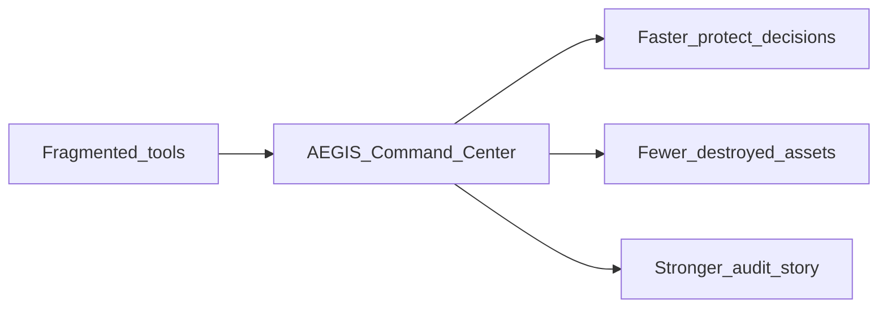
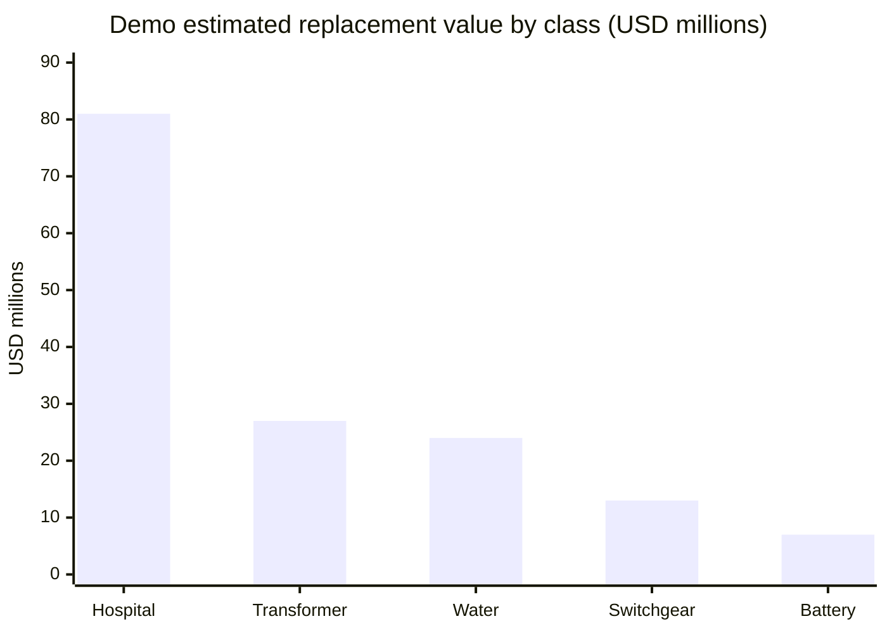
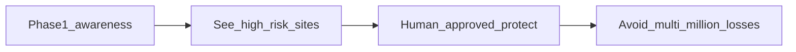
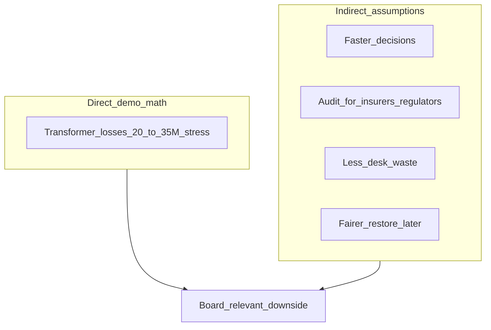
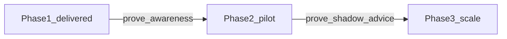
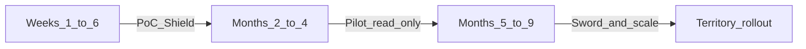

# Executive Management Briefing - AEGIS

**Product:** AEGIS, AI-Enabled Grid and Infrastructure Shield  
**Client:** Southeastern Grid and Water (SGW)  
**Prepared by:** Ankit  
**Audience:** Senior leadership and decision-makers  
**Purpose:** AECOM AI Solution Engineer submission (Deliverable 2)

Everyday language. Outcomes, money logic, governance, and a clear ask. Not a deep technical paper.  
Sample tone practice only: `03-sample-executive-briefing-aegis.md` (this file is the submission).

**Number honesty:** Dollar figures tagged **demo estimate** come from the locked prototype map (`data/assets.csv` replacement costs). They are not audited SGW book values. Percentages tagged **assumption** are directional leadership targets, not measured client baselines.

---

## Decision brief

| | |
|--|--|
| **Recommend** | Approve the **Phase 1 posture** (working prototype as proof of situational awareness) and **sponsor a Phase 2 pilot** on live read-only feeds. |
| **One-liner** | Do not scramble in the dark. **Predict, protect, then restore fairly.** |
| **Shield** | Protect critical equipment before it is destroyed (this build). |
| **Sword** | Restore power and water fairly after the storm (roadmap; not in the prototype). |

### Proof points (KPI strip)

| Demo map value at stake | Transformer estimates (Shield focus) | Decision speed target | Human control |
|-------------------------|--------------------------------------|-----------------------|---------------|
| **~$152M** estimated replacement across ~50 demo sites | **~$27M** across 12 transformers (avg ~$2.3M) | **Under 15 minutes** from alert to informed protect decision | **100%** of protect/restore actions require a person + reason |

---

## How this recommendation was developed

1. **Brainstorm:** Named missing facts; domain expert input on floods, heat, substations, water plants.  
2. **Research:** Data silos; power to water to hospital cascades; protect-then-restore priority.  
3. **Planning:** Locked one operator workflow; storm case study first; honest gaps named.  
4. **Implementation:** Working Command Center with hybrid sample data; human must approve actions. Prototype frozen for submission.

---

## 1. Strategic Business Value

### Situation

SGW serves **over 8 million residents** across coastal and inland regions exposed to hurricanes, flooding, heatwaves, and wildfires. Assets include substations, transmission, water treatment, and pumping stations. Operating costs, service disruptions, **insurance premiums**, and **regulatory pressure** on climate resilience are rising.

### Complication

Map systems, maintenance tools, weather feeds, and field tools do not form one decision picture. In a major event, leaders cannot quickly answer:

1. Which sites are about to fail?  
2. What fails next (hospitals, water, pumps)?  
3. What protect action is justified, and who authorized it?

That blindness destroys hard-to-replace equipment, wastes emergency desk time, and weakens the story told to insurers, regulators, and the public.

**Case-study honesty:** Vision is multi-hazard. The prototype proves a **coastal flood/wind** story first. Heat and wildfire reuse the same loop later.

### Resolution: AEGIS

An AI-enabled **decision support** Command Center. It advises. It does not run the grid by itself.

- One map of risk and territory counts  
- Site scores, knock-on impact, plain-English brief  
- Human-approved reduce load / shut down / restore with audit trail  
- Shared ranked list so grid and water desks hand off from the same facts  

### Why Shield before Sword

| Order | Focus | Business result |
|-------|--------|-----------------|
| First | Protect hard-to-replace equipment | Keep the machine that later restoration depends on |
| Second | Restore fairly after impact | Hospitals and vulnerable communities first; clearer public story |

You cannot restore a hospital if the equipment that feeds it is already destroyed.

### Operating KPIs (targets)

| KPI | Baseline today (typical) | Target with AEGIS | Phase |
|-----|--------------------------|-------------------|-------|
| Time to informed protect decision | Hours of stitching maps and radio | **Under 15 minutes** | 1 |
| Protect actions with reason + named approver | Ad hoc / incomplete | **100% logged** | 1 |
| High-risk sites on one shared map | Fragmented tools | **One Command Center** | 1 |
| Lifelines shown for selected site | Manual recall | **Automatic impact view** | 1 |
| Unsupervised switching by AI | Risk if over-automated | **0%** (hard rule) | 1-3 |
| Shadow advice vs operator (pilot metric) | Not tracked | Track and improve | 2 |
| Fair restore plan documented (Sword) | Manual / opaque | Documented plan with reasons | 3 |

### Emergency coordination (honest)

| Phase 1 does | Phase 1 does not |
|--------------|------------------|
| Shared map, ranked sites, impact, brief, decision log | Multi-agency dispatch, crew routing, public mass alerts |

That is coordination of **attention and authorization**, not a field dispatch product.

---

## 2. Financial Implications and Return

### Direct value: demo territory vignette

**Source:** prototype `replacement_cost` estimates on the ~50-site coastal demo map. **Illustrative only.**

| Asset class | Count | Estimated replacement (demo) |
|-------------|-------|------------------------------|
| Hospital | 8 | ~$81M (cascade / social stake; not "save the building with AEGIS") |
| Transformer | 12 | ~$27M (**Shield primary**) |
| Water plant | 6 | ~$24M |
| Switchgear | 18 | ~$13M |
| Battery | 5 | ~$7M |
| Pump | 1 | ~$0.3M |
| **Demo map total** | **~50** | **~$152M** |

**Named site example:** Fort Myers Beach Transformer about **$2.9M** estimated replacement. Early human-approved protect action is aimed at avoiding a multi-month lead-time total loss, not only the sticker price.

**Board stress case (assumption):** if about **8-10** high-value transformers are total losses in one major event at about **$2.5-3.5M** each, that is about **$20-35M** direct replacement and expedite exposure (same order of magnitude as the earlier ~$30M sketch). Full SGW scale is larger than this demo slice.

### Indirect value at ~8 million residents (assumptions)

The brief names **insurance premiums** and **regulatory pressure**. These are not priced in the prototype. Use them as leadership levers with clear labels.

| Lever | Illustrative effect | Label | Phase |
|-------|---------------------|-------|-------|
| Storm-desk scramble / handoff waste | **20-40%** less time lost stitching tools (directional) | Assumption | 1 |
| Time to informed decision | Hours to **under 15 minutes** | Target KPI | 1 |
| Protect-action audit coverage | **100%** with who / when / why | Design rule | 1 |
| Insurance / liability conversation | Stronger **prudence** narrative with documented early action | Process benefit; not a premium model | 1-2 |
| Regulatory fine / disallowance risk | Lower exposure when priorities and reasons are written | Directional | 1-3 |
| Lawsuit / brand after unfair restore | Fair lifeline-first plans | Mostly Sword | 3 |
| Lifeline outage duration (hospitals / water) | Keep as short as possible; impact graph guides attention | Outcome KPI | 1-3 |

### Cost of inaction

Without a shared risk picture, each major event keeps:

- Multi-tens-of-millions **equipment** downside on zero-spare assets  
- Slow, fragmented emergency coordination  
- A weaker story for **insurers, regulators, and the public**

Delaying a Phase 2 pilot does not pause storms. It only delays evidence that SGW can see and authorize protection in minutes.

### Investment vs return (payback logic)

| Phase | What you fund | What you get | Payback logic |
|-------|---------------|--------------|---------------|
| 1 (done) | Weeks-scale prototype | Situational awareness + human control demo | Proof before spend |
| 2 | Small sponsored pilot (people + secure read-only links + training) | Shadow advice on live feeds | **One avoided ~$3M transformer** can justify pilot economics |
| 3 | Program scale | Sword + multi-hazard packs + alerts | Avoided fines, fair restore, coordination at territory scale |

**Board line:** AEGIS targets **tens of millions** in avoided equipment loss per major storm event, plus lower insurance, fine, lawsuit, and coordination downside at customer scale, starting from a weeks-scale proof that already exists.

---

## 3. Delivery Roadmap

Prove awareness before automation. Prove Shield before Sword. Prove storm case study before equal heat/fire depth.

| Phase | Timing | Focus | Milestones | Dependencies |
|-------|--------|-------|------------|--------------|
| 1. Proof of concept | Weeks 1-6 | Situational awareness and Shield | Risk map, scores, impact, AI brief, human-approved actions (**delivered**) | Sample map and weather; executive sponsor for demo path |
| 2. Pilot | Months 2-4 | Advice on live read-only feeds | Shadow mode; people still decide; start heat/fire feature design | Secure read-only sensor/weather links; identity hardening; training |
| 3. Wider roll-out | Months 5-9 | Coordination and Sword | Crew/spare planning, alerts, multi-hazard packs | Inventory data, community vulnerability data, workforce alignment |

**Trust ladder:** past-storm tests, then shadow advice, then pilot on a few high-value sites, then wider use.

**Phase 1 does not claim:** unsupervised switching, finished crew optimizer, heat/wildfire feature parity, or production security certification.

---

## 4. Governance and Compliance

AEGIS is **advisory AI with hard human control**.

- No automatic trips. Reduce load, shut down, and restore need confirmation, a reason, and approval.  
- Decision record: who, when, why.  
- Scores and briefs cite real fields (no invented sensors).  
- Safety rules can override a calm model score in dangerous flood/wind conditions.  
- Read-only copy of sensor data into analytics; real switching stays in utility control systems.  
- Sword later: fairness for lifelines and vulnerable communities, not only equipment cost.

### Named landscape (plain)

| Where | Framework | Stance |
|-------|-----------|--------|
| US (SGW) | Critical infrastructure cyber rules (NERC CIP) | Advisory analytics on a read-only mirror; no auto switching; CIP certification **not** claimed for the prototype |
| US | State utility commissions | Audit supports a "reasonable action" / prudence story |
| US | Water emergency readiness when power fails | Power to water cascade is in the product story |
| UK (AECOM reuse) | UK data protection | DPIA when personal data + AI appear later |
| UK | AI assurance / energy ethical AI expectations | Human control, explainability, misuse awareness |

| Followed in design | Planned in pilot | Missing in prototype |
|--------------------|------------------|----------------------|
| Human approval, audit, read-only posture, grounded language | Enterprise login, dual control, shadow evidence | Production CIP stamp, hardened perimeter, formal red-team |

### Misuse (board-level)

A compromised decision-support tool could push bad protect/restore advice or leak sensitive maps. That is why AEGIS must never write into control systems, must require human approval, and must harden identity before live operations. The prototype uses a demo token. It is not production cyber defense.

---

## 5. Scalability

| Dimension | Expansion path |
|-----------|----------------|
| Hazard | Coastal storm demo today; same Command Center for heat and wildfire feature packs later |
| Domain | Power first; water treatment and pumps already in the cascade story |
| Geography | Territory subset grows with data contracts |
| Workflow | Emergency Command Center, then later field and public messaging |
| Systems plug-in | Adapters to map systems, weather, maintenance, identity, read-only sensor mirror. AEGIS does **not** replace systems of record |
| AI depth | Risk scores, sensor checks, impact graph now; deeper forecast and Sword later |
| Reuse | Same operator loop and API contract across regions and hazard packs |

---

## The ask

1. **Endorse** the delivered Phase 1 prototype as proof of situational awareness and human-controlled Shield.  
2. **Sponsor** a Phase 2 pilot: live read-only feeds, shadow advice, operator training, identity hardening.  
3. **Keep** Sword (fair restoration) and equal heat/fire depth on the Phase 3 roadmap.  
4. **Require** no write path into switching and human approval before any operational reliance.

**One-liner:** Predict, protect, then restore fairly.

---

## Appendix A - Leadership FAQ

**Is this just another dashboard?**  
No. It scores risk, shows who fails next, writes a grounded brief, and records human-authorized protect actions. The map is the surface; the decision loop is the product.

**Will the AI trip the grid?**  
No. Design rule: **0%** unsupervised switching. AEGIS advises; people approve; real trips stay in utility control systems.

**Can we trust numbers from demo data?**  
Direct dollar figures are **demo estimates** from the prototype asset list, used to show method and scale. They are not SGW's audited books. Indirect percent figures are **assumptions / targets** unless measured in a pilot.

**The brief mentions heatwaves and wildfires. Why is the demo a hurricane?**  
Prioritization under incomplete data. Coastal flood/wind was the honest first case study (public weather + cascade to water). Heat and fire share the same loop with different feature packs later.

**Where are the insurance premium savings?**  
We do not invent a premium model. We show the **prudence** mechanism: early risk view + 100% decision audit. Premium and liability outcomes are client- and market-specific.

**How does this plug into GIS and control systems?**  
Adapters pull **read-only** copies. Systems of record stay outside. Phase 2 needs sponsored data contracts and a sensor historian mirror. No write-back from AEGIS into switching.

**What if bad actors hack AEGIS?**  
Threats include false approvals, poisoned inputs, and map leakage. Mitigations: no write path to control systems, human approval, least privilege, audit, isolation. Prototype cyber is demo-grade; production hardening is a pilot gate.

**Why not build restoration optimization first?**  
You cannot restore a hospital if its feeding equipment is already destroyed. Shield first; Sword second.

**What should we approve this week?**  
Phase 1 posture + Phase 2 pilot sponsorship (scope, data access, executive sponsor, success KPIs including under-15-minute decision target and shadow-mode tracking).

**What is still missing for production?**  
Live feeds, enterprise identity, CIP evidence pack, heat/fire feature parity, Sword planner, hardened perimeter. Named honestly in the roadmap; not hidden.

---

## Mapping to the AECOM brief

| Required topic | Section |
|----------------|---------|
| Strategic Business Value | Section 1 (+ Decision brief) |
| Financial Implications and ROI | Section 2 |
| Delivery Roadmap | Section 3 |
| Governance and Compliance | Section 4 |
| Scalability | Section 5 |
